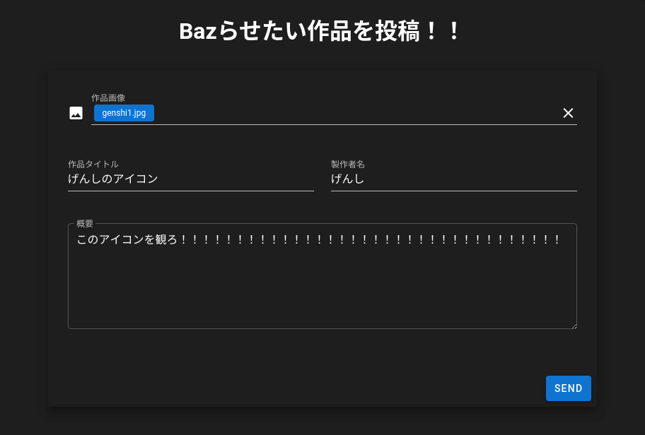
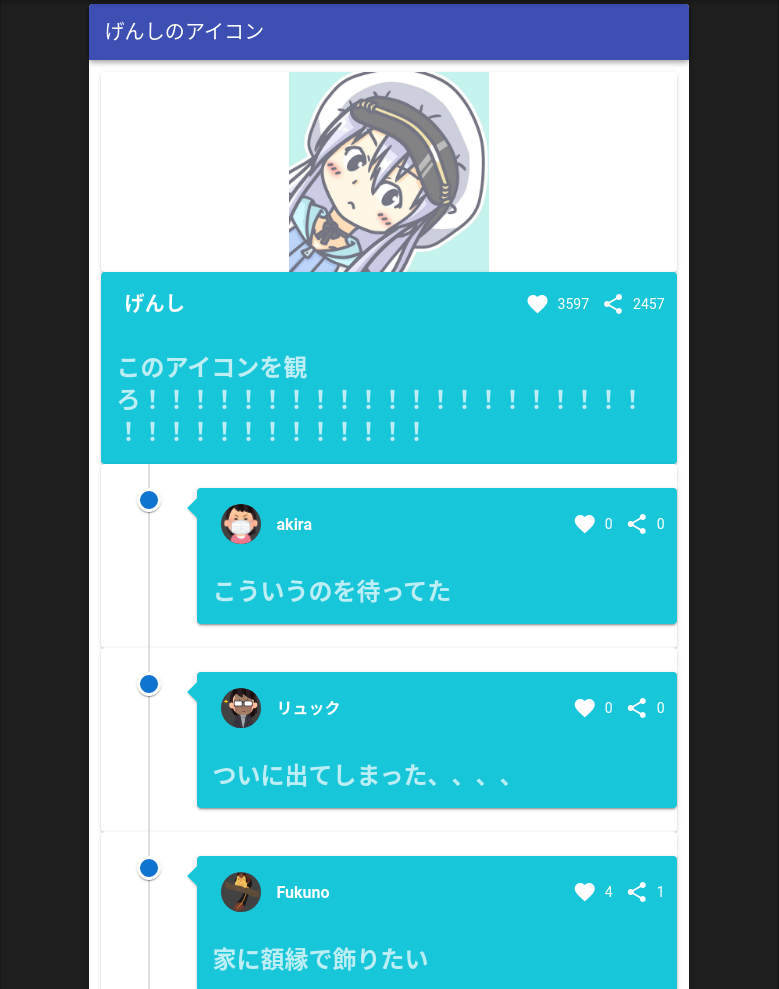

# bazup

jig.jpのインターンで僕のチームが作ったアプリです

# Requirement
 
* npm
* deno

# Setup

```bash
$ git clone https://github.com/addtobasic/bazup.git
$ cd bazup
$ npm install
```

# Start

```bash
# Start the development server.
$ npm run dev

# Start the API server.
$ npm run server
```

# DEMO

1枚目の画像の様にバズらせたい投稿内容を入力しSENDを押すと2枚目の画像の様にバズらせてくれます




